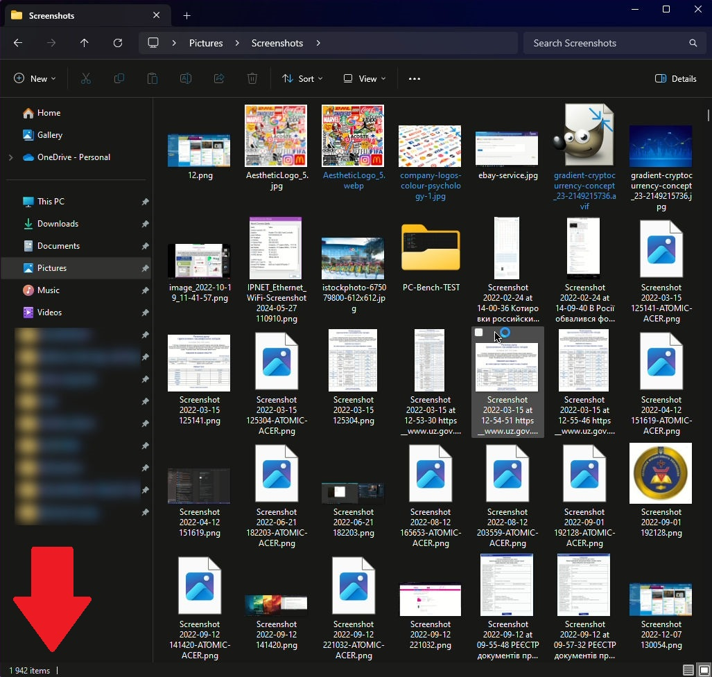
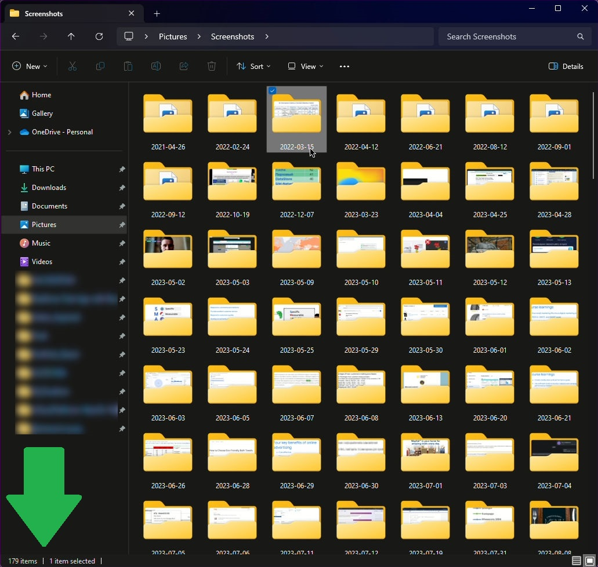

# FilesToFoldersOrganizator
This Python program organizes files in a directory by date found in their filenames. It searches for dates in the format `year-month-day`,  creates corresponding folders, and moves files into these folders.

<div>
     
  
</div>


The program is designed to organize files in a given directory by moving them into subfolders named after the date found in their filenames. This is achieved through the use of the `organize_files_by_date` function, which leverages regular expressions for date detection, and standard file operations to move files into their respective folders.

## Functions:
The core function, `organize_files_by_date(directory)`, takes a single parameter: directory, which is a Path object representing the directory to be organized. The function begins by defining a regular expression pattern, `r'\d{4}-\d{2}-\d{2}'`, which matches dates in the format `YYYY-MM-DD`.

The function then iterates through all the files in the specified directory using `os.listdir(directory)`.
For each filename, it uses `re.search(date_pattern, filename)` to search for dates matching the specified pattern.
If a `date` is found within the filename, the function extracts this date and constructs a path for a new `folder named after the date (date_folder)`.
It then creates this folder if it does not already exist using `os.makedirs(date_folder, exist_ok=True)`.
Once the date folder is prepared, the function moves the file from its current location to the newly created date folder using `shutil.move(source_file, destination_file)`.
For user feedback, the function in terminal prints a message for each file that is moved, indicating the source file and its new location.

## Main Entry Point:
The script’s entry point is designed to operate on the current working directory.
It determines the current directory by calling `Path().resolve()`, which sets `current_directory` to the directory where the script is being executed. The script then calls `organize_files_by_date(current_directory)` to organize the files within this directory.

This structure ensures that the program can be executed from any directory, and it will organize the files in that directory based on dates found in the filenames. The use of standard libraries such as `os`, `re`, `shutil`, and `pathlib` ensures that **the script is cross-platform, capable of running on Windows, Linux, BSD, and macOS systems**.

## Step-by-Step Usage Instructions for Each Operating System:

> [!CAUTION]
> **Assuming Python is installed on your system**

### General Setup (All OS):
Save the script as 'OrganizeFilesToFoldersByDate.py' in the desired directory you want to organize.
Open your terminal or command prompt.
<br>

**Windows:**
1. Navigate to the Directory by click right mouse button and holding 'Shift', in context menu find 'Open in Terminal' and your shell will open this Directory.
Or you can open the Directory using Command Prompt.
Use `cd` to navigate to the directory containing 'OrganizeFilesToFoldersByDate.py':
```
cd path\to\your\directory
```
2. Run the Script:
Execute the script by typing without brackets or quotes in the file name:
```
python OrganizeFilesToFoldersByDate.py
```
<br>

**Linux (Ubuntu, Debian) and BSD:**
It is a good reason to make the Script Executable.
1. Open Terminal.
Navigate to the directory containing 'OrganizeFilesToFoldersByDate.py':
```
cd /path/to/your/directory
```
2. Make the script executable:
```
chmod +x OrganizeFilesToFoldersByDate.py
```
3. Run the Script:
```
./OrganizeFilesToFoldersByDate.py
```
<br>

**macOS:**
1. Make the Script Executable:
Open Terminal and navigate to the directory containing 'OrganizeFilesToFoldersByDate.py':
```
cd /path/to/your/directory
```
2. Make the script executable:
```
chmod +x OrganizeFilesToFoldersByDate.py
```
3. Run the Script:
Execute the script by typing:
```
./OrganizeFilesToFoldersByDate.py
```
<br>

By following these steps, the script will organize all files in the current directory that contain dates in their filenames, moving them into folders named after the respective dates.
Now the main folder will load faster.
> [!IMPORTANT]
> If you worked with any files from this folder in programs, then keep in mind that the address of the files has changed, so you will need to add these files to the program again.
